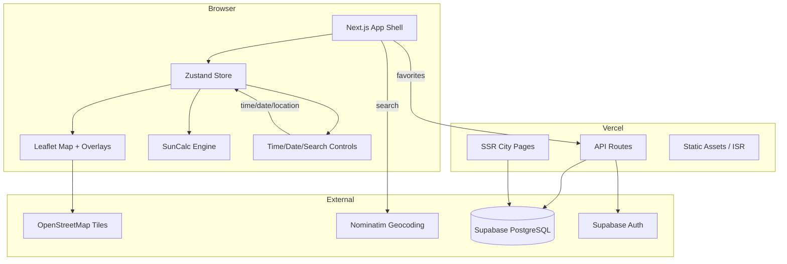

# Design: Sun Tracker Website

## Overview
A Next.js 15 App Router application with a client-heavy interactive sun tracker and server-rendered SEO city pages. All sun calculations run client-side via SunCalc. Leaflet provides the map layer. Supabase handles auth and persistence. The UI uses Tailwind CSS + shadcn/ui with a mobile-first responsive layout.

## Architecture



## Components and Interfaces

### Core State (Zustand)

```typescript
interface SunTrackerState {
  // Location
  location: { lat: number; lng: number } | null;
  locationName: string;

  // Time
  dateTime: Date;
  isAnimating: boolean;

  // Sun data (computed from location + dateTime)
  sunData: SunData | null;

  // UI state
  activeOverlays: Set<OverlayType>;
  photographerMode: boolean;
  isMobile: boolean;

  // Actions
  setLocation: (lat: number, lng: number, name?: string) => void;
  setDateTime: (dt: Date) => void;
  toggleOverlay: (overlay: OverlayType) => void;
  togglePhotographerMode: () => void;
}

interface SunData {
  sunrise: Date;
  sunset: Date;
  solarNoon: Date;
  goldenHour: { start: Date; end: Date };
  goldenHourEvening: { start: Date; end: Date };
  blueHour: { start: Date; end: Date };
  blueHourEvening: { start: Date; end: Date };
  sunAzimuth: number;       // degrees from north
  sunElevation: number;     // degrees above horizon
  sunriseAzimuth: number;
  sunsetAzimuth: number;
  shadowDirection: number;  // azimuth opposite to sun
  shadowLengthRatio: number; // tan(90 - elevation)
  dayLength: number;        // seconds
  dayLengthChange: number;  // vs previous day, seconds
}

type OverlayType =
  | 'sunrise-line'
  | 'sunset-line'
  | 'sun-position'
  | 'shadow'
  | 'golden-hour-arc'
  | 'blue-hour-arc'
  | 'sun-path';
```

### Component Tree

```
App (layout.tsx)
├── SearchBar — geocoding search + coordinate input + geolocation button
├── MapContainer
│   ├── LeafletMap — base map with OSM tiles
│   ├── LocationPin — draggable marker
│   ├── SunDirectionLines — sunrise/sunset/current azimuth lines
│   ├── HourArcOverlays — golden/blue hour arcs
│   ├── ShadowOverlay — shadow direction line
│   ├── SunPathArc — sky trajectory overlay
│   └── LayerControl — toggle overlays
├── ControlPanel
│   ├── TimeSlider — minute-resolution scrubber
│   ├── DatePicker — calendar date selector
│   ├── AnimateButton — play/pause sun animation
│   └── NowButton — reset to current time
├── InfoPanel
│   ├── SunDataDisplay — all computed sun values
│   ├── Compass — SVG compass with azimuth markers
│   └── ShadowInfo — direction + length ratio
├── PhotographerPanel (conditional)
│   ├── GoldenHourCountdown
│   ├── BlueHourCountdown
│   ├── BestDirectionIndicator
│   └── WeeklyForecast
├── FavoritesPanel — saved locations (auth required)
└── ShareExportBar — URL copy, social share, CSV/JSON export
```

## Data Models

```mermaid
erDiagram
    USER {
        uuid id PK
        string email UK
        string display_name
        timestamp created_at
    }
    FAVORITE {
        uuid id PK
        uuid user_id FK
        float lat
        float lng
        string name
        string notes
        timestamp created_at
    }
    CITY {
        serial id PK
        string slug UK
        string name
        string country
        float lat
        float lng
        string timezone
        jsonb precomputed_data
        timestamp updated_at
    }
    USER ||--o{ FAVORITE : "saves"
```



### Supabase Tables

**favorites**
| Column | Type | Constraints |
|---|---|---|
| id | uuid | PK, default gen_random_uuid() |
| user_id | uuid | FK → auth.users(id), ON DELETE CASCADE |
| lat | float8 | NOT NULL |
| lng | float8 | NOT NULL |
| name | text | NOT NULL |
| notes | text | nullable |
| created_at | timestamptz | default now() |

**cities**
| Column | Type | Constraints |
|---|---|---|
| id | serial | PK |
| slug | text | UNIQUE, NOT NULL |
| name | text | NOT NULL |
| country | text | NOT NULL |
| lat | float8 | NOT NULL |
| lng | float8 | NOT NULL |
| timezone | text | NOT NULL |
| precomputed_data | jsonb | sunrise/sunset for each month |
| updated_at | timestamptz | default now() |

### Row Level Security
- `favorites`: Users can only read/write their own rows (`auth.uid() = user_id`).
- `cities`: Public read, admin-only write.

## API Design

### Client-Side (no API needed)
- All sun calculations via SunCalc — no server round-trip.
- Geocoding via Nominatim (OpenStreetMap) — direct client fetch with rate limiting.

### API Routes

| Method | Path | Description |
|---|---|---|
| GET | `/api/favorites` | List user's saved favorites |
| POST | `/api/favorites` | Save a new favorite |
| DELETE | `/api/favorites/[id]` | Delete a favorite |
| GET | `/api/cities` | List all cities (for sitemap/linking) |
| GET | `/api/cities/[slug]` | Get city data (used by SSR) |

All favorite routes require Supabase auth token. City routes are public.

### ADR-1: Client-Side Sun Calculations

**Status:** Accepted
**Context:** Sun position data must update in real time as the user moves the time slider. Server round-trips would introduce latency.
**Options Considered:**
- Option A: Server-side calculation API — Pro: centralized logic. Con: latency on every slider move, server cost.
- Option B: Client-side SunCalc — Pro: instant updates, zero server cost, works offline. Con: bundle size (~8KB gzipped).
**Decision:** Client-side SunCalc. The 8KB cost is negligible, and real-time slider interaction demands zero-latency computation.
**Consequences:** Sun calculations are not cacheable server-side; city pages must precompute data at build time or via a cron job.

### ADR-2: Nominatim for Geocoding

**Status:** Accepted
**Context:** Need address/city search with autocomplete. Mapbox geocoding requires an API key.
**Options Considered:**
- Option A: Mapbox Geocoding — Pro: high quality, fast. Con: requires API key, usage costs.
- Option B: Nominatim (OpenStreetMap) — Pro: free, no API key. Con: rate limited (1 req/sec), slightly lower quality.
**Decision:** Nominatim with client-side debouncing (500ms) and caching of recent results.
**Consequences:** Must respect Nominatim usage policy. Add a User-Agent header. Cache results in session storage.

### ADR-3: Zustand for State Management

**Status:** Accepted
**Context:** Multiple components need shared access to location, time, sun data, and UI state.
**Options Considered:**
- Option A: React Context — Pro: built-in. Con: re-renders entire tree on state change.
- Option B: Zustand — Pro: minimal API, selective re-renders, 1KB. Con: external dependency.
**Decision:** Zustand. Selective subscriptions prevent unnecessary re-renders of the map and overlays.
**Consequences:** Must ensure SSR compatibility (Zustand supports this natively).

### ADR-4: ISR for City Pages

**Status:** Accepted
**Context:** City pages need SEO but precomputed sun data changes daily.
**Options Considered:**
- Option A: Full SSR on every request — Pro: always fresh. Con: server load, slower TTFB.
- Option B: ISR with 24-hour revalidation — Pro: fast, cached at edge, revalidates daily. Con: data could be up to 24 hours stale.
**Decision:** ISR with `revalidate: 86400` (24 hours). Sun data for a city changes slowly enough that daily revalidation is sufficient.
**Consequences:** First visit after revalidation may see stale data briefly; acceptable for this use case.

## Error Handling Strategy

| Error | Handling |
|---|---|
| Geolocation denied | Show toast, fall back to manual input |
| Nominatim rate limit | Debounce requests, show "searching..." indicator, retry after 1s |
| Supabase auth failure | Redirect to login, show error toast |
| Invalid coordinates | Validate lat [-90,90] lng [-180,180], show inline error |
| Network offline | Sun calculations still work (client-side); disable favorites/search, show offline banner |

## Testing Strategy

- **Unit tests:** SunCalc wrapper functions, state store actions, utility functions (Vitest)
- **Component tests:** Key UI components with React Testing Library
- **E2E tests:** Core user flows (search → pin → view data → share URL) with Playwright
- **Target:** 80%+ coverage on `lib/` and `hooks/`

## Security Architecture

| Threat | Vector | Mitigation |
|---|---|---|
| XSS via search input | Injected HTML in search results | Sanitize all user input, React's default escaping |
| IDOR on favorites | Accessing other users' favorites | Supabase RLS: `auth.uid() = user_id` |
| Nominatim abuse | Excessive geocoding requests | Client-side debounce + rate limiting |
| Auth token theft | XSS stealing Supabase token | HttpOnly cookies, CSP headers |
| Abuse of export | Automated scraping via export API | Rate limit export endpoint |

## Scalability and Performance

- **Target:** < 3s LCP on mobile 3G, < 1s on desktop
- **Map tiles:** Lazy-loaded, cached by browser
- **SunCalc:** ~2ms per calculation — no bottleneck
- **City pages:** ISR cached at Vercel edge — near-instant TTFB
- **Bundle:** Dynamic import Leaflet (SSR-incompatible), code-split photographer panel
- **Images:** Next.js Image optimization for any static assets

## Dependencies and Risks

| Dependency | Risk | Mitigation |
|---|---|---|
| Nominatim | Rate limiting, downtime | Cache results, fallback to manual coordinates |
| OpenStreetMap tiles | Tile server load | Use CDN tile URL, consider fallback tile provider |
| SunCalc accuracy | Edge cases at extreme latitudes (polar regions) | Document known limitations, handle null sunrise/sunset |
| Supabase free tier | Row limits, connection limits | Monitor usage, upgrade tier if needed |
