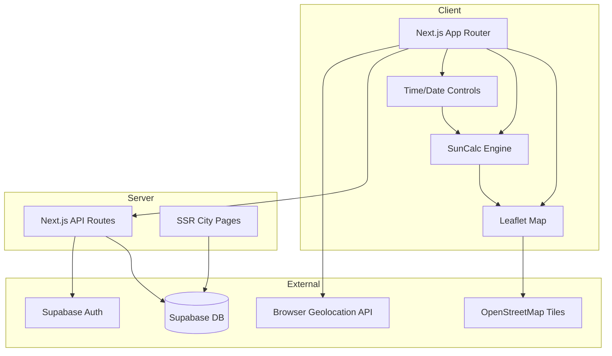

# Sun Tracker Website — Project Plan

## Goal
Build a comprehensive sun position and golden hour finder web application that helps photographers, architects, and urban planners visualize sun trajectories, plan shoots around golden/blue hours, and explore sun data for any location worldwide.

## Tech Stack
| Layer | Technology | Rationale |
|---|---|---|
| Framework | Next.js 15 (App Router) | SSR for SEO city pages, client components for interactive map |
| Language | TypeScript | Type safety across full stack |
| Styling | Tailwind CSS + shadcn/ui | Rapid UI development, consistent design system |
| Map | Leaflet + React Leaflet | Free, no API key, OpenStreetMap tiles |
| Sun Math | SunCalc | Battle-tested client-side sun position library |
| Database | Supabase (PostgreSQL) | Favorites, user accounts, precomputed city data |
| Auth | Supabase Auth | Social + email login for saved locations |
| Hosting | Vercel | Zero-config Next.js deployment |
| Package Manager | bun | Fast installs and scripts |

## Architecture Diagram



## File Structure

```
sun-tracker-website/
├── src/
│   ├── app/
│   │   ├── layout.tsx
│   │   ├── page.tsx                    # Main interactive tool
│   │   ├── city/[slug]/page.tsx        # SEO city pages
│   │   └── api/
│   │       ├── favorites/route.ts
│   │       └── cities/route.ts
│   ├── components/
│   │   ├── map/                        # Leaflet map + overlays
│   │   ├── controls/                   # Time slider, date picker
│   │   ├── panels/                     # Info panels, photographer mode
│   │   ├── compass/                    # Visual compass
│   │   └── ui/                         # shadcn/ui components
│   ├── lib/
│   │   ├── sun.ts                      # SunCalc wrapper + calculations
│   │   ├── supabase.ts                 # Supabase client
│   │   └── geo.ts                      # Geolocation utilities
│   ├── hooks/                          # Custom React hooks
│   └── types/                          # TypeScript type definitions
├── public/
├── .spec/
├── .claude/
├── .env.example
└── package.json
```

## Key Architectural Decisions
1. **Client-side sun calculations** — SunCalc runs in the browser; no server round-trips for sun data
2. **Leaflet over Mapbox** — Free tiles, no API key, sufficient for overlay-heavy usage
3. **SSR for city pages only** — Interactive tool is client-rendered; city SEO pages are server-rendered
4. **Supabase for persistence** — Favorites, bookmarks, and precomputed city data in PostgreSQL
5. **Progressive feature delivery** — Core sun tracker first, then photographer mode, then SEO pages, then advanced features
