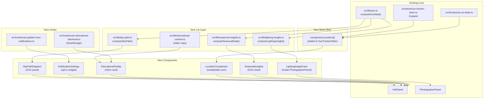

# Design: Sun Tracker v2 — Enhanced Features

## Overview

Six new capabilities are layered onto the existing brownfield Next.js 15 / React 19 / TypeScript / Tailwind / Zustand / SunCalc / Leaflet / Supabase application. All new code follows existing patterns: pure lib functions → Zustand store slices → React components. No new runtime dependencies are introduced; SVG is used instead of charting libraries.

---

## Architecture



---

## Components and Interfaces

### 1. Lighting Insight Engine

**New file:** `src/lib/lighting-insight.ts`

```typescript
export type LightingLabel =
  | "HARSH"
  | "SOFT"
  | "GOLDEN"
  | "BLUE"
  | "TWILIGHT"
  | "NIGHT";

export interface ShotSuggestion {
  label: string;       // e.g. "Perfect for silhouettes"
  technique?: string;  // e.g. "Shoot into the sun, expose for sky"
}

export interface LightingInsight {
  label: LightingLabel;
  headline: string;          // e.g. "Golden Hour — Warm, soft light"
  warningMessage?: string;   // only for HARSH
  shotSuggestions: ShotSuggestion[];
}

export function computeLightingInsight(
  sunData: SunData,
  dateTime: Date,
): LightingInsight
```

**Classification rules (pure function, no side effects):**

| Condition | Label |
|---|---|
| elevation > 45° | HARSH |
| 6° < elevation ≤ 45° | SOFT |
| dateTime within goldenHour or goldenHourEvening | GOLDEN |
| dateTime within blueHour or blueHourEvening | BLUE |
| 0° < elevation ≤ 6° | TWILIGHT |
| elevation ≤ 0° | NIGHT |

Priority order: GOLDEN > BLUE > TWILIGHT > NIGHT > HARSH > SOFT (golden/blue windows take precedence over elevation-only labels).

**New component:** `src/components/panels/lighting-insight-card.tsx`
- Consumes `LightingInsight` as a prop
- Renders: colour-coded label badge, headline, shot suggestion list, optional warning chip
- Integrated into `PhotographerPanel` between `BestDirectionIndicator` and `WeeklyForecast`
- Also rendered as a collapsed `<details>` widget in `InfoPanel` when photographer mode is off

---

### 2. Sky Path Diagram

**New file:** `src/lib/sky-path.ts`

```typescript
export interface SkyPathPoint {
  time: Date;
  elevation: number;   // degrees, clamped to [-90, 90]
  azimuth: number;     // degrees from north
  isGolden: boolean;
  isBlue: boolean;
}

export function computeSkyPath(
  lat: number,
  lng: number,
  date: Date,
  intervalMinutes?: number,  // default 10
): SkyPathPoint[]
```

Generates one point every `intervalMinutes` from midnight to midnight using existing `computeSunData()` (position-only subset via `SunCalc.getPosition`).

**New component:** `src/components/panels/sky-path-diagram.tsx`
- Pure SVG, no external charting library
- X-axis: time (0 h → 24 h)
- Y-axis: elevation (−18° → max elevation for the day)
- Renders: horizon line, sun path polyline, golden hour filled bands (amber/10 opacity), blue hour filled bands (sky/10 opacity), solar noon vertical dashed line, animated current-position dot (CSS transition on `cx`)
- Responsive via `viewBox` + `width="100%"`
- Polar edge cases: flat line + text label

---

### 3. Multi-Location Comparison

**Store extension** (added to `SunTrackerState` in `src/store/sun-tracker-store.ts`):

```typescript
comparisonLocations: ComparisonLocation[];
addComparisonLocation: (loc: ComparisonLocation) => void;
removeComparisonLocation: (index: number) => void;
clearComparisonLocations: () => void;
```

```typescript
// src/types/comparison.ts
export interface ComparisonLocation {
  lat: number;
  lng: number;
  name: string;
}

export interface ComparisonSnapshot {
  location: ComparisonLocation;
  sunrise: Date;
  sunset: Date;
  goldenHourStart: Date;
  goldenHourEnd: Date;
  dayLengthSeconds: number;
  currentElevation: number;
}
```

**New component:** `src/components/panels/location-comparison.tsx`
- Modal (desktop: fixed centre overlay, mobile: bottom sheet)
- Uses existing `SearchBar` component for location input
- Computes `ComparisonSnapshot[]` client-side via `computeSunData()` for each location + the current `dateTime`
- Max 3 columns; columns scroll horizontally on narrow screens
- "Share" button appends `?compare=lat1,lng1,name1|lat2,lng2,name2` to URL

**URL state extension** (`src/hooks/use-url-state.ts`):
- Read/write `compare` param using pipe + comma encoding
- Restores `comparisonLocations` in the store on mount

---

### 4. Seasonal Sun Insights

**New file:** `src/lib/seasonal-insights.ts`

```typescript
export interface MonthlySnapshot {
  month: number;        // 1–12
  monthName: string;    // "January" … "December"
  sunrise: Date;        // on the 21st of that month
  sunset: Date;
  goldenHourStart: Date;
  dayLengthSeconds: number;
  peakElevation: number;
}

export function computeSeasonalData(
  lat: number,
  lng: number,
  year: number,
): MonthlySnapshot[]
```

Uses `computeSunData()` for each of the 12 reference dates (21st of each month, noon local).

**New component:** `src/components/panels/seasonal-insights.tsx`
- Pure SVG chart
- X-axis: 12 months; Y-axis: day length in hours
- Sunrise time and sunset time rendered as upper/lower bounds of a bar per month
- Hover/focus shows tooltip via `<title>` element (accessible)
- Highlight: longest and shortest day bars
- Reusable on SEO city pages (`/city/[slug]`)

---

### 5. Browser Notifications

**New hook:** `src/hooks/use-golden-hour-notifications.ts`

```typescript
export type NotificationPermissionState = "default" | "granted" | "denied" | "unsupported";

export interface UseGoldenHourNotificationsReturn {
  permissionState: NotificationPermissionState;
  isScheduled: boolean;
  requestAndSchedule: () => Promise<void>;
  cancel: () => void;
}

export function useGoldenHourNotifications(
  sunData: SunData | null,
  locationName: string,
): UseGoldenHourNotificationsReturn
```

**Scheduling logic:**
1. Find the next golden hour event (morning or evening) relative to `Date.now()`.
2. Compute `msUntilAlert = eventStart - Date.now() - 30 * 60 * 1000`.
3. If `msUntilAlert > 0`: call `setTimeout`, store the timer ID in a `ref`.
4. On cancel or dependency change: call `clearTimeout` on the stored ID.
5. Notification body: `"Golden hour starts in 30 minutes at ${locationName}. Open the tracker."`

**New component:** `src/components/panels/notification-settings.tsx`
- Rendered in `InfoPanel` as a small widget
- Shows: permission state chip, "Notify me" button (hidden if unsupported or already granted), "Disable reminders" button (shown when `isScheduled`), inline help text when denied

---

### 6. Educational Insights Panel

**New file:** `src/lib/educational-content.ts`

```typescript
export interface EducationalEntry {
  term: string;         // e.g. "Golden Hour"
  shortDefinition: string;   // ≤ 20 words
  fullExplanation: string;   // 2–4 sentences, plain English
  photographyTip?: string;
}

export const EDUCATIONAL_ENTRIES: Record<string, EducationalEntry>
// Keys: "golden-hour" | "blue-hour" | "solar-noon" | "shadow-ratio" | "azimuth" | "elevation"
```

**New hook:** `src/hooks/use-educational-dismissal.ts`
- Reads/writes `localStorage` key `"edu-dismissed"` (JSON array of dismissed term keys)
- Returns `{ isDismissed(term): boolean, dismiss(term): void, resetAll(): void }`

**New component:** `src/components/panels/educational-tooltip.tsx`
- Props: `term: string`, `children: ReactNode` (wraps the data label)
- On click/focus: shows a popover card with `shortDefinition` + expand toggle for `fullExplanation`
- Dismiss button calls `dismiss(term)` via the hook; dismissed tooltips render children only (no popover)
- Fully keyboard-navigable: `role="button"`, `aria-expanded`, `aria-describedby`

---

## Data Models

No new database tables required. All new data is:
- Computed client-side (lighting insight, sky path, seasonal, comparison snapshots)
- Stored in Zustand (comparison locations, persisted to URL)
- Stored in `localStorage` (notification schedule IDs are ephemeral; educational dismissals)

### Store State Extension (immutable update pattern)

```typescript
// Added to SunTrackerState
comparisonLocations: ComparisonLocation[];   // max length 3
addComparisonLocation: (loc: ComparisonLocation) => void;
removeComparisonLocation: (index: number) => void;
clearComparisonLocations: () => void;
```

No Supabase schema changes. Existing `favorites` table is unaffected.

---

## Error Handling Strategy

| Scenario | Handling |
|---|---|
| `SunCalc.getPosition` returns NaN elevation | Clamp to 0°; treat as NIGHT in insight engine |
| Polar night (no sunrise) | `computeSkyPath` returns flat line at elevation 0; diagram shows label |
| Midnight sun (no sunset) | `computeSkyPath` returns full arc; diagram labels peak |
| Notifications API unavailable | `permissionState = "unsupported"`; opt-in button hidden |
| Notification permission denied | Inline guidance shown; no error thrown |
| Invalid `compare` URL param | Skip silently; restore only valid entries |
| `localStorage` unavailable (SSR, private mode) | `use-educational-dismissal` catches and returns `isDismissed = false` always |

---

## Testing Strategy

All new lib functions are pure and fully unit-testable:

| File | Test file | Strategy |
|---|---|---|
| `src/lib/lighting-insight.ts` | `src/__tests__/lib/lighting-insight.test.ts` | Parametrized unit tests covering all 6 labels + boundary conditions |
| `src/lib/sky-path.ts` | `src/__tests__/lib/sky-path.test.ts` | Verify point count, elevation range, golden/blue flags at known times |
| `src/lib/seasonal-insights.ts` | `src/__tests__/lib/seasonal-insights.test.ts` | Verify 12 entries returned, longest/shortest day correct for known lat/lng |
| `src/hooks/use-golden-hour-notifications.ts` | `src/__tests__/hooks/use-golden-hour-notifications.test.ts` | Mock `Notification` API; verify schedule/cancel |
| `src/hooks/use-educational-dismissal.ts` | `src/__tests__/hooks/use-educational-dismissal.test.ts` | Mock `localStorage`; verify dismiss/reset |
| Components | `src/__tests__/components/*.test.tsx` | RTL render tests; no snapshot tests |

Coverage target: 80%+ (existing project standard). Vitest + Testing Library (existing toolchain).

---

## Security Architecture

| Threat | Vector | Mitigation |
|---|---|---|
| XSS via location name in notification body | Notification body constructed from store state | Store name comes from geocoding API response already validated upstream; truncate to 100 chars before use |
| URL param injection in compare param | `compare` parsed from URL | Parse only `lat`/`lng` as floats via `parseFloat` + `isFinite` check; `name` HTML-encoded before display |
| localStorage pollution | `edu-dismissed` read/written | JSON.parse inside try/catch; invalid values reset to `[]` |

No new API routes → no new server-side attack surface.

---

## Scalability and Performance

- All new computations are O(n) client-side (n ≤ 144 sky-path points, 12 seasonal points, 3 comparison snapshots) — negligible.
- `computeSkyPath` memoised via `useMemo` keyed on `lat + lng + date.toDateString()`.
- `computeSeasonalData` memoised via `useMemo` keyed on `lat + lng + year`.
- SVG diagrams use `viewBox` — no canvas, no ResizeObserver required.
- Notifications use `setTimeout` — no WebSocket, no Service Worker in v2.

---

## Dependencies and Risks

| Risk | Likelihood | Mitigation |
|---|---|---|
| Web Notifications API blocked by browser default | Medium | Feature-detect and degrade gracefully |
| `computeSkyPath` slow on old devices (144 SunCalc calls) | Low | Memoisation + increase interval to 15 min if needed |
| Store state growth (comparison locations) | Low | Hard cap at 3 locations enforced in `addComparisonLocation` |
| InfoPanel becoming too tall with 3 new widgets | Medium | All new panels are collapsible `<details>` elements by default |

**No new npm dependencies introduced.**

---

## ADR-1: SVG Over Charting Library

**Status:** Accepted
**Context:** Sky path diagram and seasonal chart require custom rendering (golden/blue hour bands, animated dot). Charting libraries (Chart.js, Recharts) add 50–150 KB and impose opinionated APIs that fight with Tailwind.
**Options Considered:**
- Option A: Recharts — Pro: familiar API. Con: 100 KB bundle, hard to customize SVG layers.
- Option B: Raw SVG — Pro: zero bundle cost, full control, SSR-safe. Con: more code.
**Decision:** Raw SVG. The two diagrams are simple enough (polyline + filled regions + a dot) that hand-rolled SVG is less code than fighting a library's defaults.
**Consequences:** Team must write SVG path math; covered by unit tests.

---

## ADR-2: setTimeout Over Service Worker for Notifications

**Status:** Accepted
**Context:** Golden hour notifications could use a Service Worker for reliability when the tab is closed.
**Options Considered:**
- Option A: Service Worker push — Pro: works when tab is closed. Con: requires HTTPS + service worker registration + push subscription setup; significantly more complexity.
- Option B: `setTimeout` in-tab — Pro: zero infrastructure, works immediately. Con: only fires while tab is open.
**Decision:** `setTimeout` for v2. The use case (casual reminder while using the app) fits tab-local scheduling. Service Worker deferred to v3.
**Consequences:** Notifications only fire while the tab is open. This is documented in the UI.

---

## ADR-3: Zustand Slice Extension Over Separate Store

**Status:** Accepted
**Context:** Comparison locations need to be accessible from `InfoPanel`, `LocationComparison`, and `use-url-state`.
**Options Considered:**
- Option A: Separate Zustand store — Pro: isolation. Con: two stores to subscribe to; URL sync hook needs to import both.
- Option B: Extend existing `SunTrackerState` — Pro: single subscription; URL hook already imports the store.
**Decision:** Extend existing store. The comparison state is not large enough to justify a second store.
**Consequences:** `SunTrackerState` grows by 3 fields + 3 actions. Existing tests unaffected (new fields have defaults).
